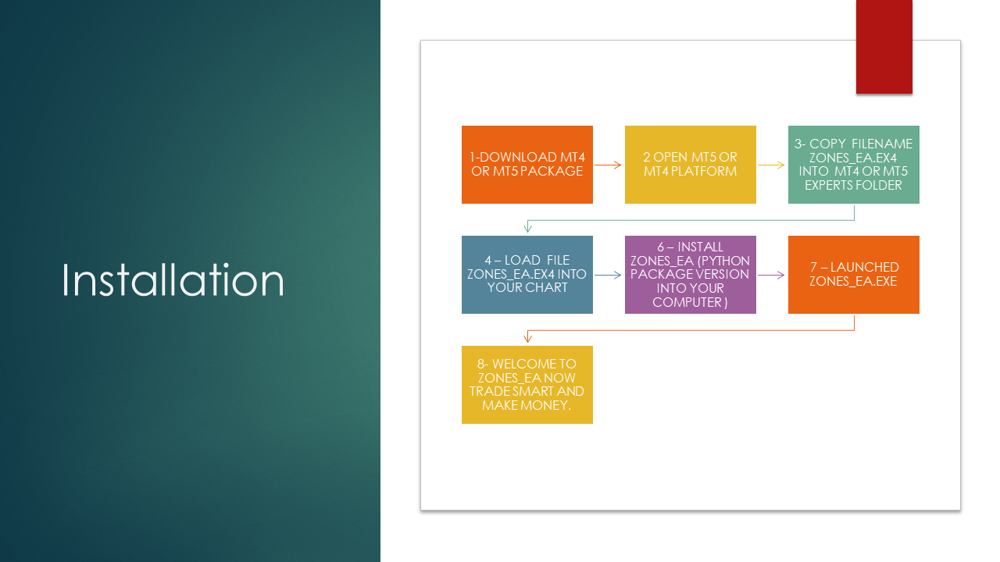

#WELCOME  TO  ZONES  

PYTHON  AI  MetaTrader 4 software

     copyright (c) 2022 - 2023  

     

## Icon

# Description

          ZONES EA  is an ai powered professional  
          trading application using the standard platform MT4,MT5, and others

# Architecture

## Growing list of features:

- AI Trading Terminal
- Mysql database connection
- Telegram client
- screenshot
- Trade Reports
- Trade News event
- Live trade on Telegram
- Live trade copies
- VPS
- Upcoming features cryptocurrency trading Terminal integration
  

# ________ Installation _____________
## Requirements
    - Python ~= 3.11
    - pyzmq
    - zmq
    - mysql
    - mql-zmq (library package)
    - pandas

# Zones_EA.exe ,MT4 or MT5 Installation flow

## Documentation

See documentation [click here !](src/docs/ZONESEA.pdf)

# Linux installation:

You can run your strategies on linux through wine

Here is a ready docker Wine:   [click here](https://hub.docker.com/docker-wine/nguemechieu/zones_ea)

# Virtual environment

-     commands:
-         docker pull zones
-         docker run  zones Xvfb :99 -screen 0 1024x768x16 & python zones.py
